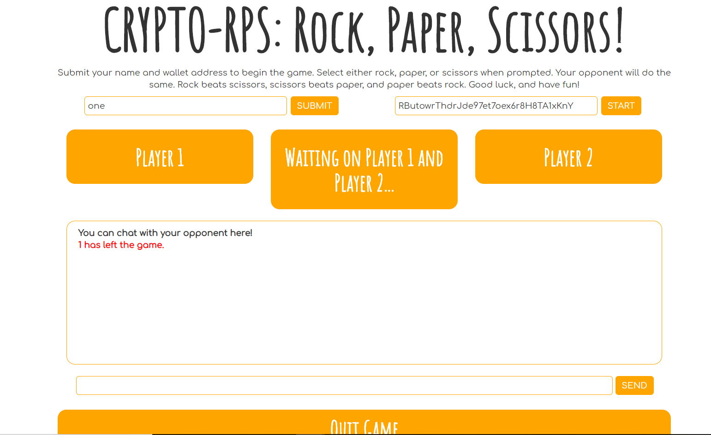
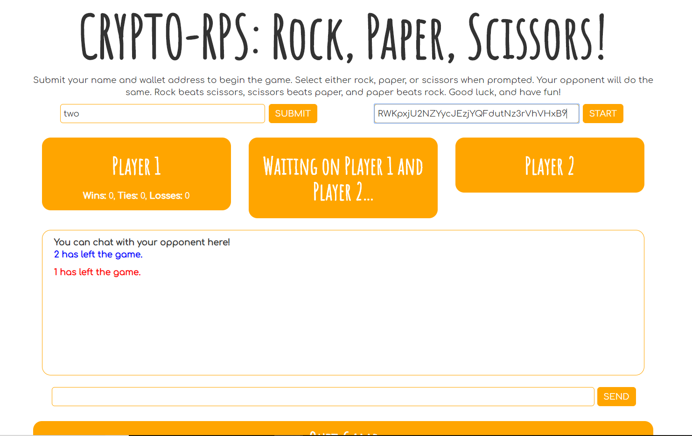
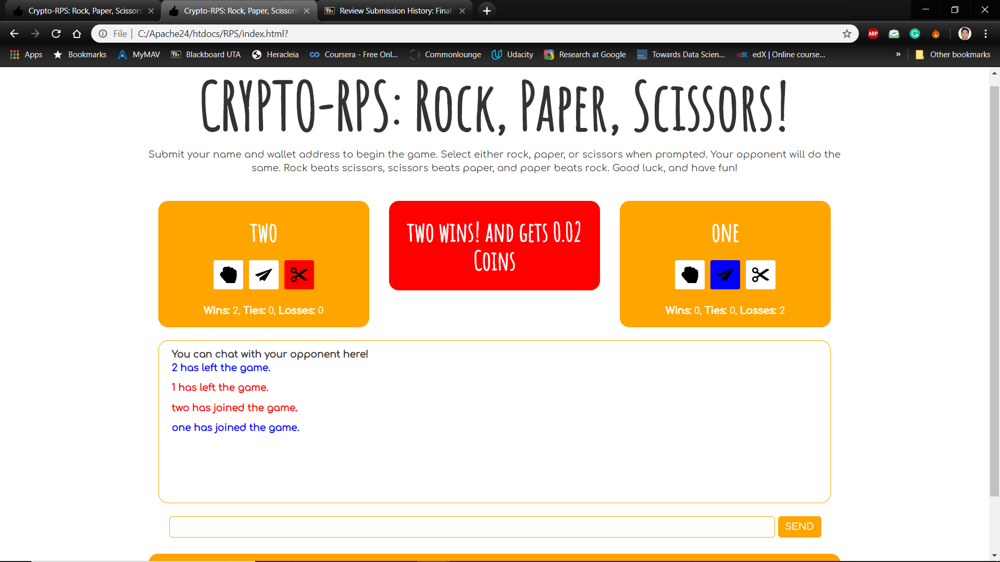

# Crypto-RPS
A multi-player interactive web application to play rock-paper-scissor game and win Komodo coins.

## Player 1 Interface

## Player 2 Interface

## The Game

### Project Details
Apache and Nodejs has been installed on the user computer to run the web application.  
After the installation, The application can be simply run by opening Crypto-RPS/index.html which is the html page for the game.  
  
Plus, the CSS and JS files have been added in the directory Crypto-RPS/assets/.  
  
The Dapp uses Komodo Blockchain assets to transfer coins to the winner.  
The JSON-RPC method has been used to execute the komodo sendtoaddresss command on the server node.
